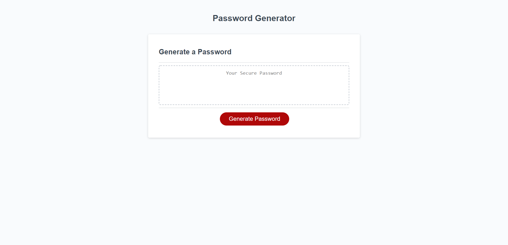

# Java-Password_Generator

Deployed Site: https://joetrops5.github.io/Java-Password_Generator/

Github URL: https://github.com/joetrops5/Java-Password_Generator

The webpage now prompts the user how long he/she wants the password to be 
The page also prompts the user if they want to include uppercase, lowercase, 
symbols or numbers. The password is then generated and displayed inside the text box. 

</img>
